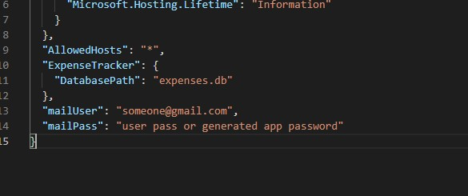
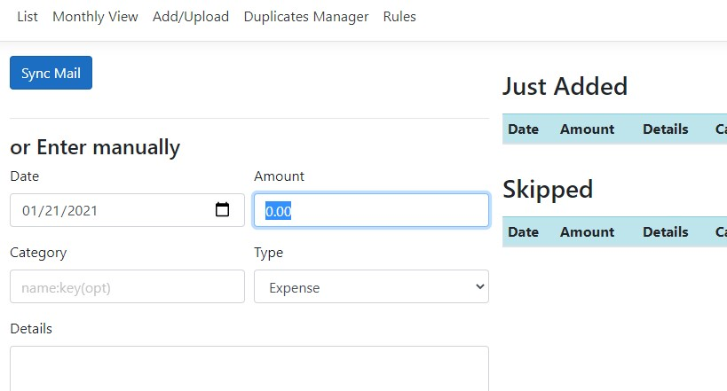
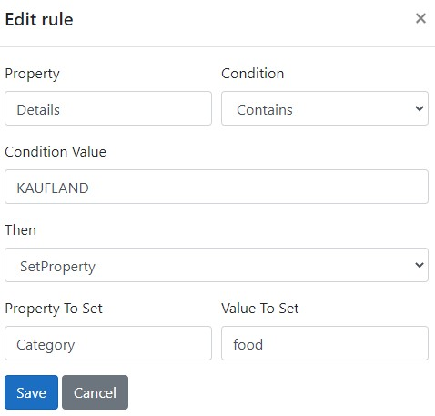

# Expense-tracker

Web app to keep track of your spendings with integrations to email notifications and generated reports to some banks in Bulgaria.

## TOC
1. [Quick setup](#quick-setup)
1. [Configure email integration](#Configure-email-integration)
1. [Automate with rules](#Automate-with-Rules)
1. [Limitations](#limitations)

## Quick setup
Get the prepackaged exe file for winx64 from
[HERE](https://github.com/todorm85/expense-tracker/releases/download/1.0.0/ExpenseTracker_WinX64_exe.zip).

Run ExpenseTracker.Web.exe - it should self host and display address on which to connect to the web app. Usually it will be http://localhost:5000. Navigate in your web browser to the address.

The app is prepackaged with everything needed to run in WinX64, no need for web server or database server to be preinstalled. It uses self-contained NoSql db (Litedb) that will create a file to contain your imported expenses (expenses.db) in the same directory.

For better UX use Google Chrome, both Windows and Android.

## Configure Gmail integration

You can sync email messages for expenses that your bank sends (see Limitations for banks). In appsettings.json add the following two properties with respective values on top level:

If a successful connection can be made then a new button to sync mails should appear

_Currently, gmail is supported and you need to add all the messages to a label named "expenses" (you can create automatic rules). If you have 2FA you need to create an app password in your google account instead of using your account password. You can also forward emails automatically form another mailbox to a specially dedicated mailbox for tracking your expenses for better security. Also, if you host the app outside your personal pc do not provide the configurations in appsettings.json but rather through environment variables (read the docs of aspnet core 3.1)._

## Automate with Rules

You can specify rules to automatically tag imported transactions in Rules.

Here the rule will mark any transaction that contains the word "KAUFLAND" in its details description with Category set to "food".

## Limitations

- Transactions from same period but different sources should not be imported as this might lead to duplicate entries (ex. importing transactions from a given account from email and then importing for the same account but from a generated report file for the same period). Importing from same source is safe and will not duplicate your transactions. However, if you are not sure or by mistake have overlapped periods when importing from mail and then from a file you could use the "Duplicate manager" tool to review those potential duplicates. This limitation comes from the fact that there are no unique identifiers for the transactions in email for most banks. The app tries to generate one but there isn`t sufficient information.
- supported banks are Allianz and Raiffeisen for email messages and for txt files for allianz and xml files for Raiffeisen